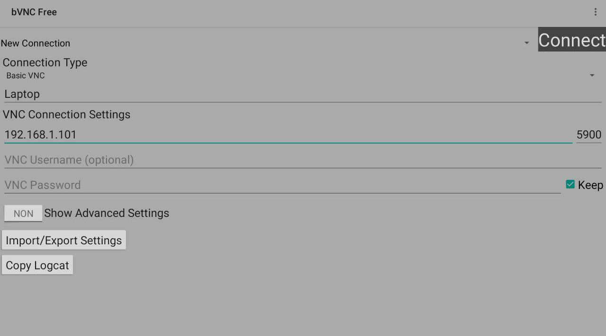

# Tutorial

Do you have any old **Android tablet** at home? Then you have a new **second screen** for your laptop! With this tutorial you will be able to use any Android device to extend your screen on Linux. For this purpose we are going to use a wireless connection, but it can also be done through a USB cable.

> I guess this tutorial can also be done with an iPad or other laptop instead of an Android tablet, but I don't have the possibility to check it.

### Test environment
- Laptop with Ubuntu 18.04
- Nvidia Geforce GTX 1660Ti
- Intel Core i7-9750H (Intel UHD Graphics 630)

### Necessary software
- In the computer:
	- a VNC server (as for example _x11vnc_)
	```bash
	sudo apt install x11vnc
	```
- In the tablet:
	- a VNC client app: I recommend you [_bVNC Free_](https://play.google.com/store/apps/details?id=com.iiordanov.freebVNC&hl=en) because it has more security options than other apps.


## Workaround

### 1. Get some information

Firt we need to know available displays and output ports.
```
xrandr
```

The output should be something like this (I removed some entries because the output was very long):
```
Screen 0: minimum 8 x 8, current 1920 x 1080, maximum 32767 x 32767
HDMI-0 disconnected primary (normal left inverted right x axis y axis)
eDP-1-1 connected 1920x1080+0+0 (normal left inverted right x axis y axis) 344mm x 194mm
   1920x1080    144.00*+  60.01    59.97    59.96    59.93  
   1680x1050     84.94    74.89    69.88    59.95    59.88  
   1600x1024     60.17  
   1400x1050     85.00    74.76    70.00    59.98  
   1600x900      59.99    59.94    59.95    59.82  
   1280x1024     85.02    75.02    60.02  
   1440x900      59.89  
   [...]
   480x270       59.63    59.82  
   400x300       85.27    72.19    75.12    60.32    56.34  
   432x243       59.92    59.57  
   320x240       85.18    72.81    75.00    60.05  
   360x202       59.51    59.13  
   360x200       85.04  
   320x200       85.27  
   320x180       59.84    59.32  
   320x175       85.27  
DP-1-1 disconnected (normal left inverted right x axis y axis)
HDMI-1-1 disconnected (normal left inverted right x axis y axis)
```
As you can see, my current display is `eDP-1-1` with the resolution _1920x1080 144.00Hz_. The unused output ports are `HDMI-0`, `DP-1-1` and `HDMI-1-1`. You may have a different output ports and resolutions depending on your graphic card.

### 2. Create a new virtual monitor

We need to know the tablet's resolution. In my case is _1280x800_. 

> If you don't know your tablet's resolution, visit [this site](https://whatismyandroidversion.com) from your tablet's web browser and it will show you your screen resolution. If it is different from mine you will have to replace it in all the commands.

Generate modeline for the resolution of the VPN screen. Run in terminal:
```
gtf 1280 800 60
```
> _60_ is the **screen refresh rate** for the tablet

The modeline generated by this command is:
```
# 1280x800 @ 60.00 Hz (GTF) hsync: 49.68 kHz; pclk: 83.46 MHz
  Modeline "1280x800_60.00"  83.46  1280 1344 1480 1680  800 801 804 828  -HSync +Vsync

```

Copy everything after the word `Modeline` (exclude it) into the next command. Now let's add a new mode for our Android device:

```
xrandr --newmode "1280x800_60.00"  83.46  1280 1344 1480 1680  800 801 804 828  -HSync +Vsync
```

Add this new mode to an unused output port. `HDMI-1-1` in this case.
> You can try the output ports that work for you.

```
xrandr --addmode HDMI-1-1 1280x800_60.00
```

Now let’s enable `HDMI-1-1` and move it to the left of the default display (`eDP-1-1`). After this mouse cursor can be moved to the left side more than your default display allows. It is because we are adding 1280×800 to the left side of `eDP-1-1`.

```
xrandr --output HDMI-1-1 --mode 1280x800_60.00 --left-of eDP-1-1
```
> If you want to put the second screen in the right side of the default display just change the option `--left-of` by `--right-of`.

The final step is to start the VNC server:
```
x11vnc -clip 1280x800+0+0
```

Now you need to connect your Android device using a VNC client. To do so you need an IP and port. To find your computer's IP run:
```
ip a
```

In my case it is 192.168.1.67. The **default port** in VNC is **5900** unless you changed it.


_Screenshot of the bVNC Free app_

### 3. Disable the second screen

After stopping the VNC server you need to disable the second screen `HDMI-1-1`:
```
xrandr --output HDMI-1-1 --off
```

So once you have created the modeline for `HDMI-1-1` you don't need to create it again the next time you want to use it, just run the last commands:
```
# Enable the second display
xrandr --output HDMI-1-1 --mode 1280x800_60.00 --left-of eDP-1-1
x11vnc -clip 1280x800+0+0

# Disable
xrandr --output HDMI-1-1 --off
```

### Clean modes

To remove the mode:
```
xrandr --delmode HDMI-1-1 "1280x800_60.00"
xrandr --rmmode "1280x800_60.00"
```

### Check displays and modes
```
xrandr -q
```

------------------------------------

### Resources I used to create this tutorial

- https://sangams.com.np/using-android-pc-as-a-second-monitor-in-linux/
- https://askubuntu.com/a/750497
- https://github.com/brunodles/linux-second-screen/blob/master/tutorial.md
